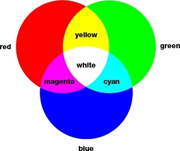

# Primary Color Mixer

## Background

This color chart displays the rules for the mixing of additive primary colors of red, green, and blue to create the secondary colors of yellow, magenta, or cyan. 

## Directions
After accepting the Lab4 assignment, clone your Lab4 repository to your virtual machine, add your solution code and test it against the correct results that match the 
interface prototype example shown below. Write a program that prompts the user to enter two primary colors as strings: “red”, “green”, or “blue”. Once entered, the program 
outputs the resulting secondary color. The program should be designed to respond to invalid colors or duplicate colors such as blue mixed with blue or orange mixed with green. 
It should also handle first letter capitalization of colors.

## Interface Prototype Example

### Test Case 1 Output
<pre><b>Enter the first primary color to mix (red, green, or blue): red
Enter the second primary color to mix (red, green, or blue): blue
The secondary color you mixed is magenta.
Bye!</b></pre>
### Test Case 2 Output
<pre><b>Enter the first primary color to mix (red, green, or blue): blue
Enter the second primary color to mix (red, green, or blue): orange
The secondary color you mixed is invalid.
Bye!</b></pre>
### Test Case 3 Output
<pre><b>Enter the first primary color to mix (red, green, or blue): green
Enter the second primary color to mix (red, green, or blue): green
The secondary color you mixed is invalid.
Bye!</b></pre>
### Test Case 4 Output
<pre><b>Enter the first primary color to mix (red, green, or blue): Green
Enter the second primary color to mix (red, green, or blue): Red
The secondary color you mixed is yellow.
Bye!</b></pre>

